# reto_final_sqa
reto final de sqa 

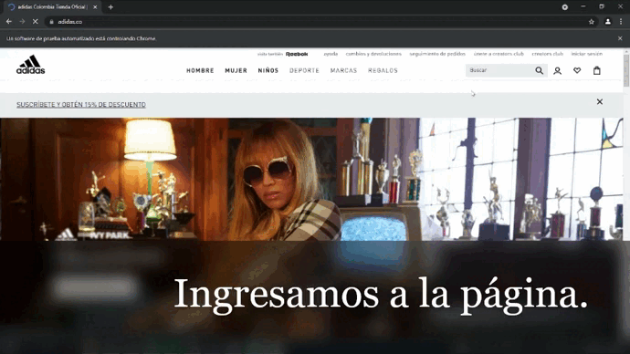

### Infomación proyecto
<table>
<tr>
  <th>Dependencias</th>
  <td>
     * <a> implementation 'net.serenity-bdd:serenity-junit:2.0.80'</a> 
	 *<a> implementation 'net.serenity-bdd:serenity-cucumber:1.9.45'</a> 
	 *<a> implementation 'net.serenity-bdd:serenity-junit:2.0.80'</a> 
	 *<a> implementation 'org.slf4j:slf4j-simple:1.7.7'</a> 
	 *<a> implementation group: 'org.apache.poi', name: 'poi', version: '3.17'</a> 
	 *<a> implementation group: 'org.apache.poi', name: 'poi-ooxml', version: '3.17'</a> 
	 *<a> chromedriver.exe</a>
    </td>
<tr>
<tr>
  <th>Estructura</th>
  <td>
      <a> SCreenplay</a>
  </td>
<tr>
</table>
 paquetes:
	+ runners: AdidasBuscadorStepsRunner.java.
	+ <table>
<tr>
  <th>AdidasBuscador5ProductosStepsRunner.java.</th> 

  <td>
   <a> 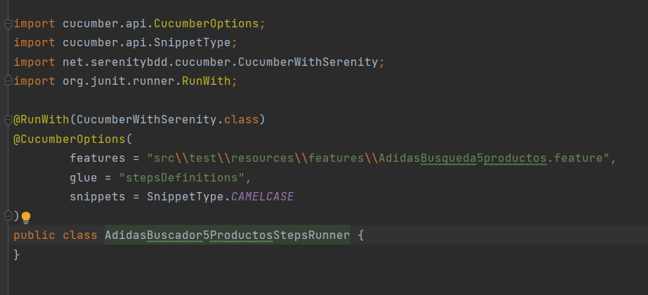 </a>  
este ejecuta el primer punto del reto 
	 
  
<tr>
<tr>
  <th>AdidasBuscadorBackgroundStepsRunner.java.</th>
  <td>
         <a> 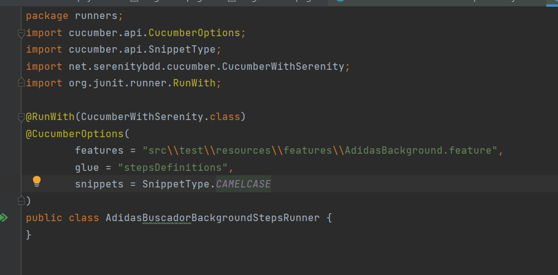 </a>  
este ejecuta el segundo punto del reto 
  </td>
<tr>
  <tr>
    <th>AdidasEscenarioExitosoYFallidoStepsRunner.java.</th>
  <td>   <a> 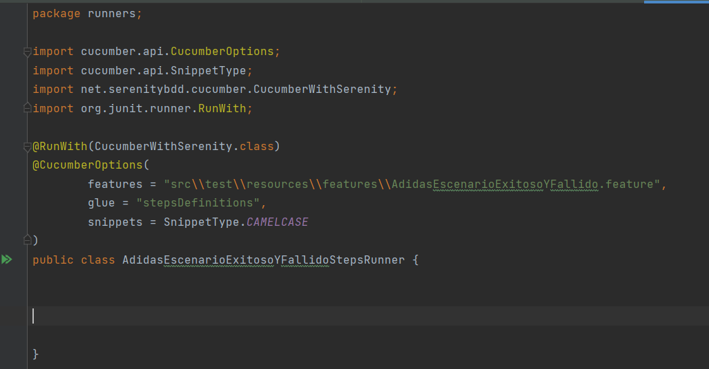 </a>  
este ejecuta el tercer punto del reto 
  </td>
<tr>
</table>

- drivers: GoogleChromeDriver.java
   
	<a> 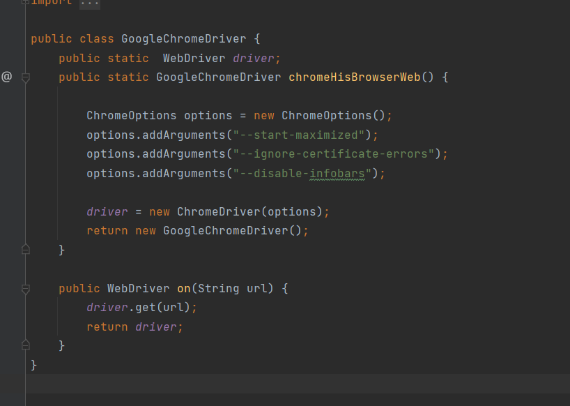 </a>  
   se confirgo el navegador para la simulación
	
  
 - taks: AdidasBuscador.java
   
	<a> 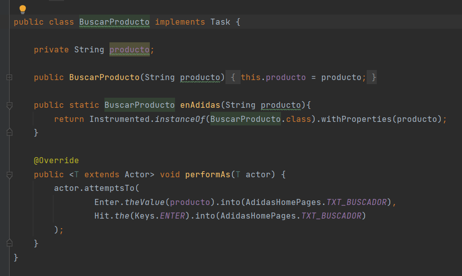 </a>  
   se le especifica al actor que hacer 
	 
	
  - uis:
  
AdidasHomePages.java:
	 
<a>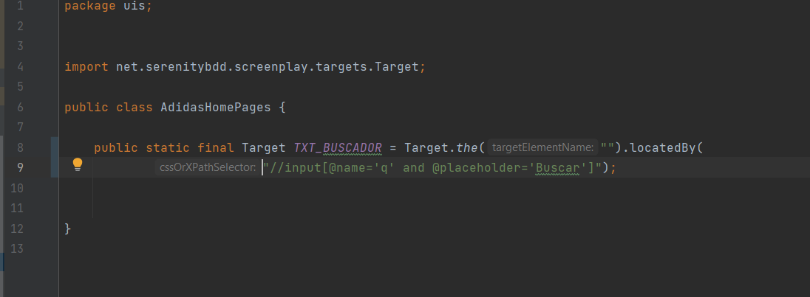</a>
	
Contiene los Xpath necesarios de la vista principal de la pagina para realizar las pruebas
			
AdidasProductoPages.java:
  
<a>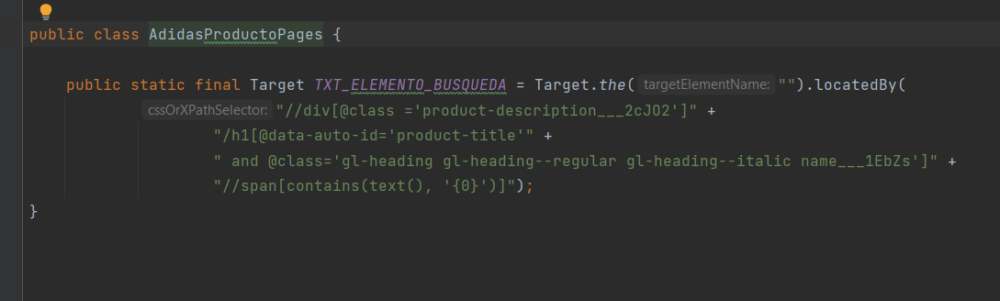</a>
		
Contiene los Xpath necesarios de la vista del procducto de la pagina para realizar las pruebas en este
caso un span que contiene el nombre el producto.
   
  
  
- definitions:
<table>
<tr>
  <th>AdidasBuscador5ProductosStepsDefinitions.java.</th> 

  <td>
   <a> 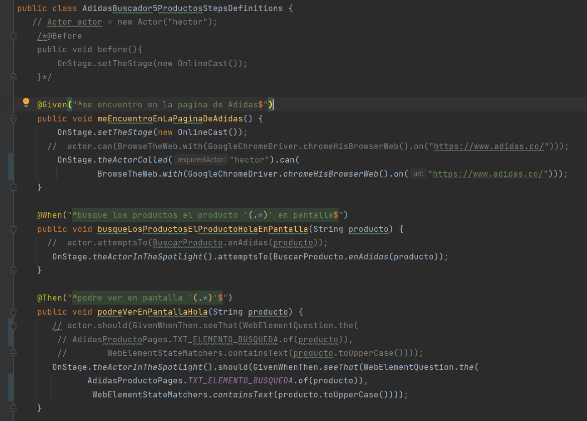 </a>  
   se es especifica los 5 productos de prueba
	 
  
<tr>
<tr>
  <th>AdidasBuscadorBackgroundStepsDefinitions.java.</th>
  <td>
         <a> 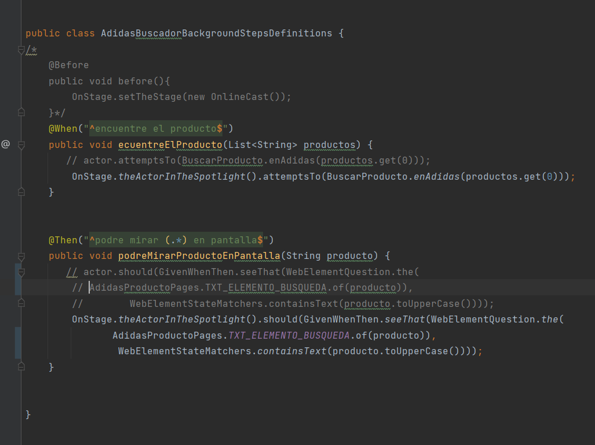 </a>  
se es especifica los2 escenarios con  el given en comun atraves del background </td>
<tr>
  <tr>
    <th>AdidasEscenarioExitosoYFallidoStepsDefinitions.java.</th>
  <td>   <a> 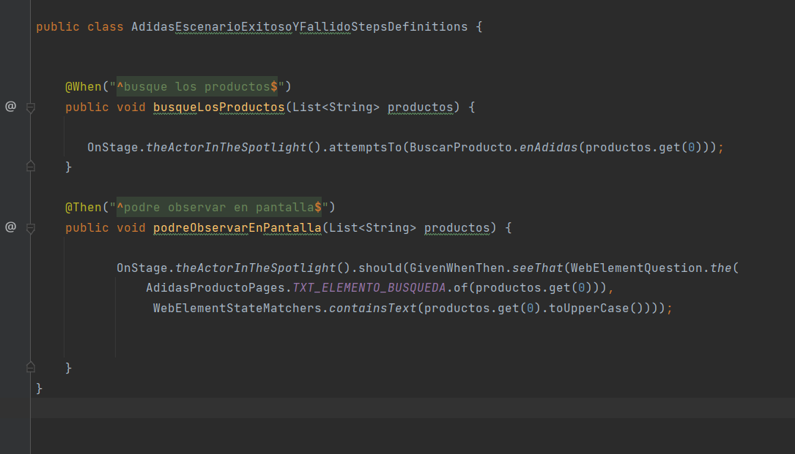 </a>  
   se ejecuta dos escenarios uno exitoso y uno fallido
  </td>
<tr>
</table>

- Informe:

<a>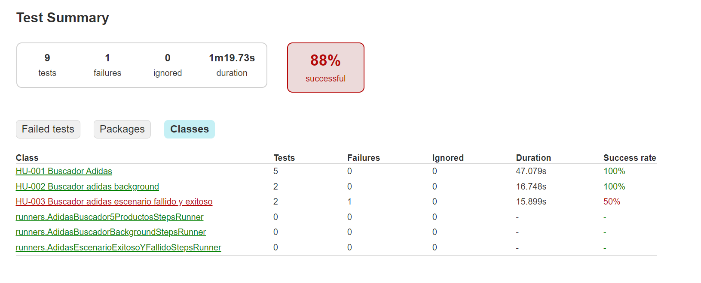</a>

como se puede observar en el informe  los pruebas que fueron exitoso
y cuales fallaron
			
